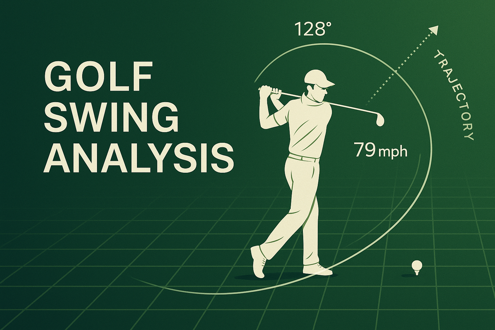
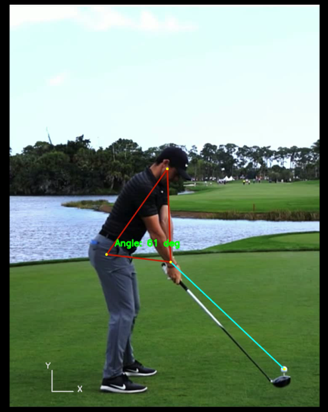

# Golf Swing Analysis using MediaPipe



[](https://www.python.org/)
[](https://opencv.org/)
[](https://mediapipe.dev/)

[](https://github.com/HeleenaRobert)

A Python project that analyzes golf swings using **MediaPipe Pose**. It tracks body landmarks, calculates swing angles, detects swing phases, and exports per-frame metrics — producing an annotated video and a structured JSON file ready for coaching or visualization.

---

## ✨ Features

- Processes all video files in `input/` automatically (MP4, MOV, AVI, MKV, M4V, WMV).
- Detects body landmarks using MediaPipe Pose and computes four angles per frame:
  - **Ear–Hip–Wrist** — overall arm/body connection
  - **Hip Rotation** — hip line angle relative to horizontal
  - **Shoulder Tilt** — shoulder line angle relative to vertical
  - **Spine Angle** — torso lean from vertical
- Auto-detects the golf ball position using shape-based circle detection (color-agnostic).
- Segments the swing into phases: address, backswing, top, downswing, impact, follow-through.
- Exports per-frame metrics and phase summaries to a JSON file in `output/`.
- Adds an **X/Y axis overlay** for spatial reference.
- Saves annotated video automatically in `output/`.

---

## 📂 Folder Structure

```text
golf-swing-analysis/
│
├── golf_swing_analysis.py       # Entry point
│
├── utils/
│   ├── swing_utils.py           # Pose detection, angle math, phase detection, export
│   └── video_utils.py           # Video I/O helpers
│
├── input/                       # Drop swing videos here (auto-created on first run)
│
├── output/                      # Annotated videos + JSON files (auto-created)
│
├── models/                      # MediaPipe model (auto-downloaded on first run)
│
├── assets/
│   ├── banner.png
│   └── video_sample_image.png
│
├── HOW_IT_WORKS.md
├── requirements.txt
├── LICENSE
├── .gitignore
└── README.md
```

---

## 🚀 How It Works

1. Scans `input/` for any supported video files.
2. Processes each frame with **MediaPipe Pose**.
3. Draws landmarks, swing lines, angle text, and axes.
4. Detects swing phases from the wrist trajectory.
5. Writes the annotated frames to `output/` as MP4.
6. Exports per-frame metrics and phase data to `output/` as JSON.

For a detailed breakdown of the pipeline, see [HOW_IT_WORKS.md](HOW_IT_WORKS.md).

---

## 🖼 Sample Output

_(Output video will be saved in `output/` as MP4.)_

 

---

## 🔧 Installation

```bash
git clone https://github.com/HeleenaRobert/golf-swing-analysis.git
cd golf-swing-analysis

# Windows
pip install -r requirements.txt

# Mac
python3 -m venv venv
source venv/bin/activate
pip install -r requirements.txt
```

---

## ▶️ Usage

1. Run the script once to auto-create the `input/` and `output/` folders:

   ```bash
   python golf_swing_analysis.py
   ```

2. Drop one or more swing videos into the `input/` folder (any supported format).
3. Run the script again — all videos in `input/` will be processed automatically.
4. Results are saved in `output/`:
   - `<video_name>_out_landmarks.mp4` — annotated video
   - `<video_name>_swing_data.json` — per-frame metrics and phase data

Supported formats: MP4, MOV, AVI, MKV, M4V, WMV

---

## 📌 Notes

- The `input/` and `output/` folders are created automatically on first run.
- The golf ball is detected automatically using shape-based circle detection — no hardcoded position needed. If detection fails, the ball annotation is skipped gracefully.
- The MediaPipe model (`models/pose_landmarker_full.task`) is downloaded automatically on first run.
- Works best with **down-the-line swing videos**.

---

## 🛠 Technologies Used

- [Python 3.8+](https://www.python.org/)
- [OpenCV](https://opencv.org/)
- [MediaPipe Pose](https://mediapipe.dev/solutions/pose.html)
- [NumPy](https://numpy.org/)

---

## 📜 License

This project is licensed under the [MIT License](LICENSE).

---

## 👩‍💻 Author

**Heleena Robert**  
[GitHub](https://github.com/HeleenaRobert)
